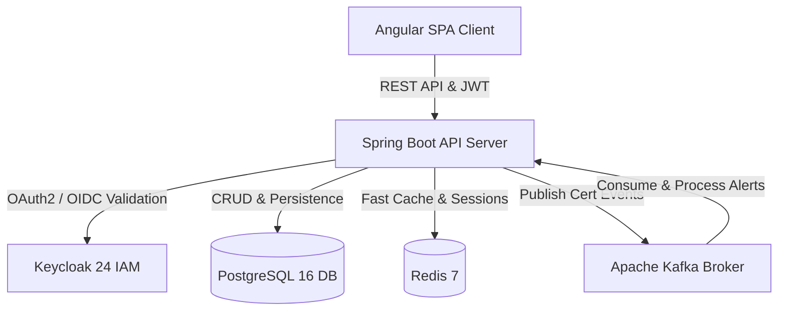

# 🌐 SkillSphere

[](https://spring.io/projects/spring-boot)
[](https://angular.io/)
[](https://www.postgresql.org/)
[](https://kafka.apache.org/)
[](https://www.keycloak.org/)
[](https://www.docker.com/)
[](LICENSE)

> **SkillSphere** is an enterprise-grade platform engineered to streamline **skill cataloging, competency gap mapping, continuous learning roadmaps, and automated certification lifecycle tracking** with event-driven architecture and Single Sign-On (SSO).

---

## 📑 Table of Contents

- [Overview](#-overview)
- [System Architecture](#-system-architecture)
- [Key Features](#-key-features)
- [Technology Stack](#-technology-stack)
- [Project Structure](#-project-structure)
- [Getting Started](#-getting-started)
  - [Prerequisites](#prerequisites)
  - [1. Infrastructure Setup (Docker Compose)](#1-infrastructure-setup-docker-compose)
  - [2. Backend Setup (Spring Boot)](#2-backend-setup-spring-boot)
  - [3. Frontend Setup (Angular)](#3-frontend-setup-angular)
- [API Endpoints Overview](#-api-endpoints-overview)
- [Security & Authentication](#-security--authentication)
- [License](#-license)

---

## 🌟 Overview

Modern organizations struggle with skill fragmentation, untracked employee competencies, and compliance lapses due to expired certifications. **SkillSphere** resolves these challenges by providing:
1. **Dynamic Skill Matrix**: Real-time tracking of employee proficiency levels across technical and soft skills.
2. **Competency Gap Analysis**: Automatic gap matching between an employee's existing skill profile and their target career path.
3. **Structured Learning Paths**: Sequential course journeys with interactive modules and assessments.
4. **Event-Driven Certifications**: Automated certificate generation, verification, and renewal workflows powered by **Apache Kafka**.

---

## 🏛️ System Architecture



---

## ✨ Key Features

### 👤 1. Identity & Role-Based Access Control (RBAC)
- Full integration with **Keycloak** (OAuth2/OpenID Connect).
- Custom `KeycloakRoleConverter` mapping Keycloak realms/roles to Spring Security authorities (`ADMIN`, `MANAGER`, `EMPLOYEE`).

### 📊 2. Dynamic Skill Profiles & Catalog
- Centralized skill taxonomy with categorization (e.g., Cloud, Backend, Data, Soft Skills).
- Employee-specific proficiency level tracking (Beginner, Intermediate, Advanced, Expert).

### 🎓 3. Learning Paths & Course Delivery
- Multi-tier course structure with individual modular contents.
- Sequential learning pathways with real-time enrollment progress tracking.

### ⚡ 4. Event-Driven Certification Pipeline (Kafka)
- Automated assessment verification upon module completion.
- Background asynchronous emission and processing of certification events via **Apache Kafka**.
- Comprehensive audit trails and renewal reminder triggers.

### 🎯 5. Competency Mapping & Career Planning
- Compare employee skill sets against target Job roles.
- Identify competency shortfalls and recommend actionable courses.

### 📈 6. Executive Compliance & Analytics
- Visual dashboards for tracking organizational skill coverage.
- Real-time compliance health checks and audit logs.

---

## 🛠️ Technology Stack

| Domain | Technology | Description |
| :--- | :--- | :--- |
| **Backend** | Java 17, Spring Boot 3.x | Core REST API, Spring Data JPA, Hibernate, Lombok |
| **Security** | Spring Security, Keycloak 24 | OAuth2 Resource Server, JWT token verification, RBAC |
| **Frontend** | Angular 17+, TypeScript, RxJS | Responsive Single-Page Application (SPA) dashboard |
| **Database** | PostgreSQL 16 | Primary relational database |
| **Messaging** | Apache Kafka 7.5, Zookeeper | Asynchronous event publishing and certification consumer |
| **Caching** | Redis 7 | High-performance session & query caching |
| **DevOps** | Docker, Docker Compose | Multi-container infrastructure orchestration |

---

## 📂 Project Structure

```text
SkillSphere/
├── database/                    # Database migrations & schemas
├── frontend/                    # Angular Single Page Application
│   ├── src/
│   │   ├── app/
│   │   │   ├── auth/            # Keycloak & route guards
│   │   │   ├── services/        # API services (Skill, Learning, Cert)
│   │   │   ├── app.component.*  # Main dashboard UI & views
│   │   └── styles.css           # Global theme & typography
│   └── package.json
├── infra/                       # Infrastructure configuration
│   └── docker-compose.yml       # Postgres, Redis, Kafka, Zookeeper, Keycloak
├── src/main/java/com/skillsphere/
│   ├── config/                  # SecurityConfig, Kafka & Data Initializers
│   ├── controller/              # 19+ REST Controllers (Skill, Course, Cert, User)
│   ├── dto/                     # Request & Response Data Transfer Objects
│   ├── entity/                  # JPA Entities (Employee, Skill, Course, Cert)
│   ├── repository/              # Spring Data JPA Repositories
│   └── service/                 # Business logic implementation
├── pom.xml                      # Maven project descriptor
└── README.md
```

---

## 🚀 Getting Started

### Prerequisites
- **Java JDK 17+**
- **Node.js 18+** & **npm**
- **Docker Desktop** (for running Postgres, Kafka, Keycloak)
- **Maven** (optional, wrapper `./mvnw` is included)

---

### 1. Infrastructure Setup (Docker Compose)
Spin up PostgreSQL, Redis, Kafka, Zookeeper, and Keycloak in isolated containers:

```bash
# Navigate to the infra directory
cd infra

# Start all backing services
docker-compose up -d
```

Verify that services are running:
- **PostgreSQL**: `localhost:5432`
- **Keycloak Console**: `http://localhost:8081` (Admin: `admin` / `admin`)
- **Kafka Broker**: `localhost:9092`
- **Redis**: `localhost:6379`

---

### 2. Backend Setup (Spring Boot)

From the project root:

```bash
# Build and run with Maven Wrapper
./mvnw spring-boot:run
```

The Spring Boot backend will start on **`http://localhost:8080`**.

---

### 3. Frontend Setup (Angular)

```bash
# Navigate to the frontend directory
cd frontend

# Install dependencies
npm install

# Start the development server
npm start
```

Navigate to **`http://localhost:4200`** in your browser.

---

## 🔌 API Endpoints Overview

| Endpoint Prefix | Description |
| :--- | :--- |
| `/api/skills` | Skill catalog management and lookup |
| `/api/skill-profiles` | Employee skill proficiency and matrix |
| `/api/courses` | Course catalog, content modules, and lessons |
| `/api/learning-paths` | Curated multi-course learning trajectories |
| `/api/enrollments` | Course enrollment and progress updates |
| `/api/assessments` | Quiz and evaluation engine |
| `/api/certifications` | Digital certificate issuance & audit |
| `/api/competency-mapping` | Role competency matching & gap analysis |
| `/api/analytics` | Organization-wide compliance & metrics |

---

## 🔒 Security & Authentication

SkillSphere leverages **OAuth2 / OpenID Connect** with **Keycloak**:
1. All client requests must include a valid Bearer JWT: `Authorization: Bearer <token>`.
2. The custom `KeycloakRoleConverter` extracts roles from `realm_access.roles` and secures endpoints with `@PreAuthorize` / `hasRole(...)`.
3. Granular security rules ensure employees can only view their respective data, while managers and admins have organizational overview.

---

## 📄 License

This project is licensed under the **MIT License** — feel free to use and adapt it for enterprise and academic purposes.

---

### 👤 Author
- **GitHub**: [@vishalkcse](https://github.com/vishalkcse)
- **Repository**: [SkillSphere](https://github.com/vishalkcse/SkillSphere)
